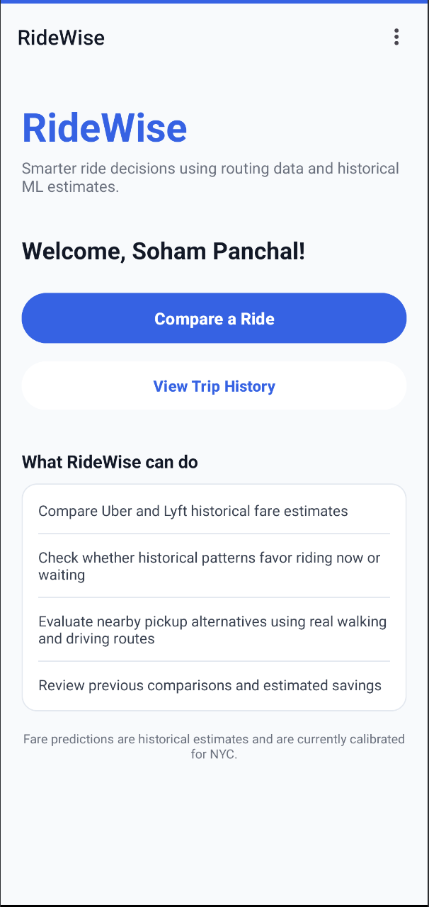
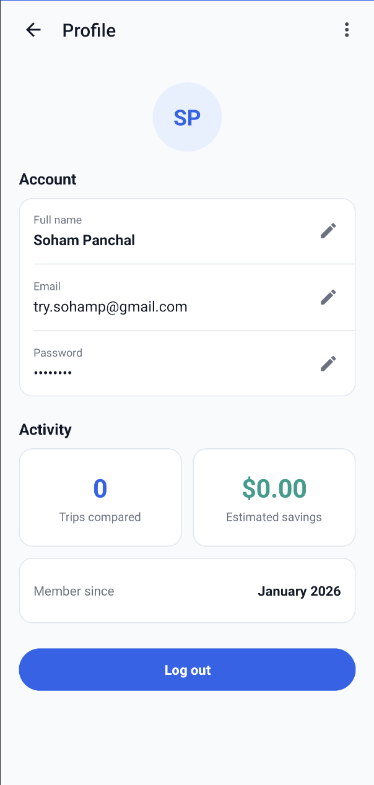

# RideWise

RideWise is an Android ride-decision application that combines real routing data with machine-learning-based fare prediction to help users compare ride options and decide whether to ride now, wait, or walk to a nearby pickup point.

The project uses a native Android client, a FastAPI backend deployed on Google Cloud Run, Google Routes for traffic-aware routing, NYC taxi-zone geospatial data, and provider-specific XGBoost models trained on public NYC TLC High Volume For-Hire Vehicle trip records.

> RideWise does **not** provide live Uber or Lyft prices. Fare values shown in the app are historical ML estimates based on NYC TLC trip patterns.

---

## App Screenshots

<p align="center">
  
  
  
</p>

<p align="center">
  
  
  
</p>

---

## Features

### Ride Comparison
- Compare historical Uber and Lyft fare estimates
- View traffic-aware trip distance and duration
- View prediction ranges derived from historical model error
- Open Uber or Lyft directly through provider deep links

### Wait & Save
- Evaluates future time windows using historical time-of-day patterns
- Compares predicted fares for now, +30, +60, and +90 minutes
- Recommends waiting only when predicted savings pass a minimum threshold

### Walk Nearby
- Generates nearby alternate pickup candidates
- Validates walking routes using Google Routes
- Recalculates traffic-aware driving routes from alternate pickup points
- Runs fare prediction for each valid alternative
- Recommends walking only when predicted savings justify it

### Trip History
- Stores ride comparisons using Firebase
- Displays predicted fare and estimated savings
- Tracks number of trips compared
- Displays aggregate estimated savings

### Market-Aware Fallback
RideWise currently calibrates ML predictions for New York City.

For trips outside supported NYC taxi zones:

- real route distance is still shown
- traffic-aware travel time is still shown
- Uber and Lyft deep links remain available
- ML fare predictions are not generated
- Wait & Save and Walk Nearby are disabled

This prevents the NYC-trained models from being presented as reliable predictions in unsupported markets.

---

## Tech Stack

### Android
- Java
- Android SDK
- Retrofit
- Gson
- Firebase Authentication
- Cloud Firestore
- Google Places SDK for Android
- Google Maps / navigation deep links
- Uber and Lyft deep links

### Backend
- Python 3.13
- FastAPI
- Pydantic
- Uvicorn
- HTTPX

### Machine Learning
- XGBoost
- scikit-learn
- pandas
- joblib

### Geospatial
- GeoPandas
- Shapely
- NYC TLC Taxi Zone shapefiles

### Cloud & APIs
- Google Cloud Run
- Google Routes API
- Google Places API
- NYC TLC public HVFHV trip data

---

## Architecture

```text
                         ┌─────────────────────────┐
                         │      Android App        │
                         │         Java            │
                         └────────────┬────────────┘
                                      │
                         HTTPS / Retrofit
                                      │
                                      ▼
                    ┌─────────────────────────────┐
                    │       FastAPI Backend       │
                    │      Google Cloud Run       │
                    └──────────────┬──────────────┘
                                   │
              ┌────────────────────┼────────────────────┐
              │                    │                    │
              ▼                    ▼                    ▼
    ┌─────────────────┐  ┌──────────────────┐  ┌───────────────────┐
    │ Google Routes   │  │ NYC Taxi Zone    │  │ XGBoost Models    │
    │ API             │  │ Resolver         │  │                   │
    │                 │  │                  │  │ Uber + Lyft       │
    │ Driving         │  │ Pickup zone      │  │ fare prediction   │
    │ Traffic         │  │ Dropoff zone     │  │ + error ranges    │
    │ Walking         │  │                  │  │                   │
    └─────────────────┘  └──────────────────┘  └───────────────────┘

              ┌──────────────────────────────────────────┐
              │ Firebase Authentication + Cloud Firestore│
              │ accounts, trip history, profile data     │
              └──────────────────────────────────────────┘
```

---

## Machine Learning Pipeline

RideWise uses public NYC TLC High Volume For-Hire Vehicle trip records.

Provider records are separated using TLC provider identifiers:

- `HV0003` → Uber
- `HV0005` → Lyft

The training pipeline:

1. Loads NYC TLC HVFHV trip records
2. Cleans invalid and incomplete trips
3. Separates Uber and Lyft records
4. Engineers route, temporal, and geographic features
5. Performs a chronological train/validation split
6. Trains separate XGBoost regression models
7. Evaluates each model
8. Saves the fitted pipelines and metrics as deployment artifacts

### Main Features

Numerical features include:

- trip distance
- trip duration
- average speed
- pickup hour
- day of week
- weekend indicator
- rush-hour indicator
- late-night indicator
- airport-trip indicator

Categorical features include:

- pickup taxi zone
- dropoff taxi zone
- route pair

---

## Model Validation Results

Training was performed on approximately 1.5 million sampled NYC TLC HVFHV records using a chronological validation split.

| Provider | Validation Rows | MAE | RMSE | R² | Median Absolute Error | 80th Percentile Error |
|---|---:|---:|---:|---:|---:|---:|
| Uber | 1,127,859 | $4.90 | $8.95 | 0.835 | $2.54 | $7.10 |
| Lyft | 369,468 | $3.15 | $5.83 | 0.894 | $1.77 | $4.22 |

The app displays prediction ranges using the model's historical 80th-percentile absolute error.

These ranges are **not statistical confidence intervals**.

---

## Core API Endpoints

### Health

```http
GET /health
```

Checks backend health and model availability.

### Analyze Trip

```http
POST /v1/analyze-trip
```

Uses Google Routes to calculate the trip and returns:

- route distance
- traffic-aware trip duration
- Uber historical fare estimate
- Lyft historical fare estimate
- prediction ranges

For unsupported geographic markets, routing information is returned without fare predictions.

### Wait & Save

```http
POST /v1/wait-and-save
```

Evaluates historical fare predictions across multiple future time windows and recommends either:

- ride now
- wait

### Walk Nearby

```http
POST /v1/walk-nearby
```

Evaluates nearby pickup alternatives using:

- candidate pickup generation
- real Google walking routes
- traffic-aware driving routes
- NYC taxi-zone resolution
- provider-specific ML predictions

---

## Example Analyze Trip Request

```json
{
  "pickup_lat": 40.7580,
  "pickup_lon": -73.9855,
  "dropoff_lat": 40.6413,
  "dropoff_lon": -73.7781
}
```

Example route:

```text
Times Square → JFK Airport
```

---

## Local Backend Setup

From the repository root:

```bash
cd backend
```

Create a Python 3.13 environment:

```bash
python3.13 -m venv .venv
source .venv/bin/activate
```

Install dependencies:

```bash
pip install -r requirements.txt
```

Create:

```text
backend/.env
```

with:

```env
GOOGLE_ROUTES_API_KEY=YOUR_SERVER_SIDE_GOOGLE_ROUTES_KEY
```

Download NYC taxi-zone geometry:

```bash
python scripts/download_taxi_zones.py
```

Run the backend:

```bash
uvicorn app.main:app --reload
```

The local API will be available at:

```text
http://127.0.0.1:8000
```

---

## Android Setup

RideWise requires Java 17 for the Android build.

Create or update the repository-root:

```text
local.properties
```

Example:

```properties
sdk.dir=/path/to/Android/sdk
MAPS_API_KEY=YOUR_ANDROID_GOOGLE_API_KEY
BACKEND_BASE_URL=https://your-backend-url/
```

Do not commit real API keys.

Set Java 17:

```bash
export JAVA_HOME=$(/usr/libexec/java_home -v 17)
export PATH="$JAVA_HOME/bin:$PATH"
```

Build:

```bash
./gradlew assembleDebug
```

Install on an emulator or connected Android device:

```bash
adb install -r app/build/outputs/apk/debug/app-debug.apk
```

---

## Model Artifacts

Trained Uber and Lyft model artifacts are included in the repository so the deployed backend can run without retraining the full dataset.

Raw TLC parquet files are intentionally excluded because of their size.

Artifacts are stored under:

```text
backend/ml/artifacts/
```

The raw training dataset remains excluded from Git.

---

## Taxi Zone Data

NYC taxi-zone shapefiles are not committed directly to the repository.

They are installed automatically using:

```bash
python backend/scripts/download_taxi_zones.py
```

The same downloader is used during the Docker build so Cloud Run deployments contain the required geospatial files.

---

## Deployment

The FastAPI backend is containerized using Docker and deployed to Google Cloud Run.

The production container:

1. installs Python dependencies
2. copies backend code and trained model artifacts
3. downloads NYC taxi-zone geometry
4. starts FastAPI using Uvicorn
5. listens on the Cloud Run-provided `PORT`

---

## Project Structure

```text
RideWise/
├── app/
│   └── src/main/
│       ├── java/com/example/ridewise/
│       │   ├── models/
│       │   ├── network/
│       │   ├── repository/
│       │   └── utils/
│       └── res/
│           ├── drawable/
│           ├── layout/
│           ├── menu/
│           └── values/
│
├── backend/
│   ├── app/
│   │   ├── main.py
│   │   ├── schemas.py
│   │   └── services/
│   │       ├── predictor.py
│   │       ├── route_service.py
│   │       └── zone_resolver.py
│   │
│   ├── ml/
│   │   ├── train.py
│   │   └── artifacts/
│   │
│   ├── scripts/
│   │   └── download_taxi_zones.py
│   │
│   ├── Dockerfile
│   └── requirements.txt
│
├── screenshots/
├── README.md
└── ...
```

---

## Design Decisions

### Why separate Uber and Lyft models?

Uber and Lyft records exhibit different historical fare distributions. Separate models allow each provider to learn its own patterns instead of forcing a single model to approximate both.

### Why XGBoost?

The problem primarily uses structured tabular data with nonlinear interactions between:

- distance
- duration
- time
- geographic zones
- route pairs
- airport trips

XGBoost provides strong performance for this type of data while remaining practical to train and deploy.

### Why not use live Uber or Lyft prices?

RideWise does not have access to a permitted live fare-comparison feed from both providers.

Rather than simulate live pricing, the app clearly presents its values as historical ML estimates and sends users to the provider applications for final pricing.

### Why restrict predictions to NYC?

The models were trained on NYC TLC data.

Using those models for Texas, California, or other markets would create misleading predictions because pricing behavior, geography, route structure, and demand patterns differ by market.

RideWise therefore degrades gracefully outside NYC instead of pretending the model generalizes everywhere.

---

## Limitations

- Fare estimates are based on historical data, not live Uber or Lyft pricing.
- Current ML calibration is limited to NYC.
- Prediction ranges are based on historical model error and are not guaranteed fare bounds.
- Wait & Save evaluates historical temporal patterns and does not predict future live surge pricing.
- Walk Nearby savings are historical predictions and may differ from the final provider fare.
- Provider applications remain the source of truth for final booking prices.

---

## Status

RideWise v1 core functionality is complete.

Completed components include:

- Android client
- Firebase authentication
- trip history
- Google Places integration
- FastAPI backend
- Cloud Run deployment
- Google Routes integration
- geospatial NYC taxi-zone resolution
- provider-specific XGBoost fare prediction
- prediction ranges
- Wait & Save
- Walk Nearby
- non-NYC graceful fallback
- provider deep links
- UI redesign and consistency pass
- reproducible model and taxi-zone deployment setup

---

## Disclaimer

RideWise is an independent educational project.

It is not affiliated with, endorsed by, or sponsored by Uber, Lyft, Google, or the New York City Taxi and Limousine Commission.

All trademarks belong to their respective owners.
